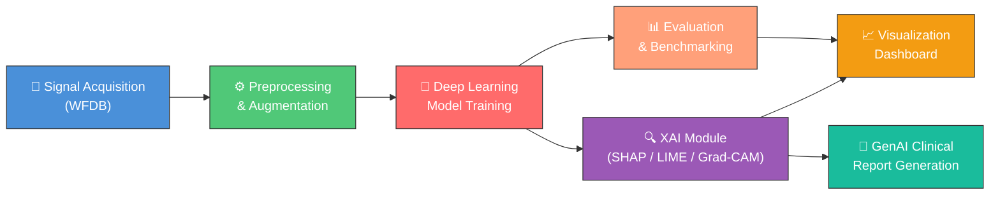
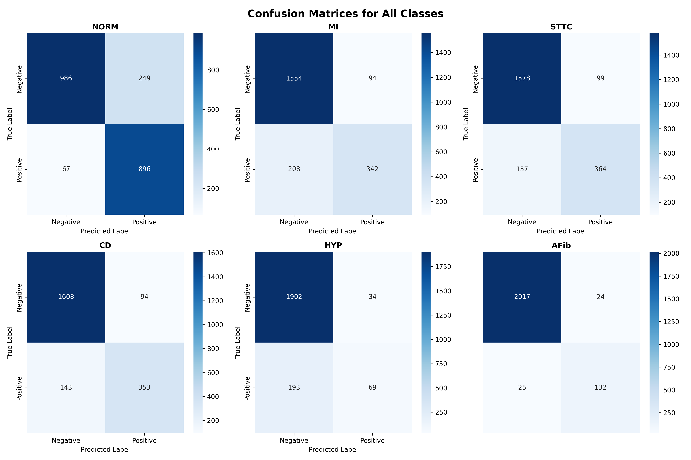
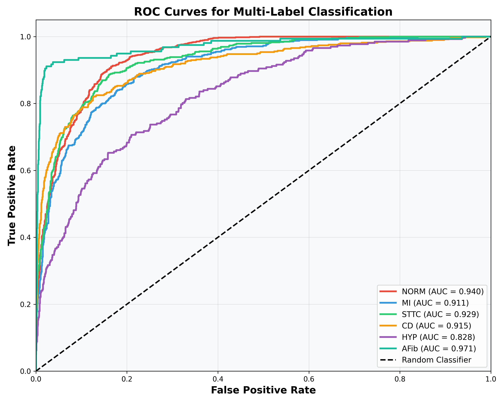
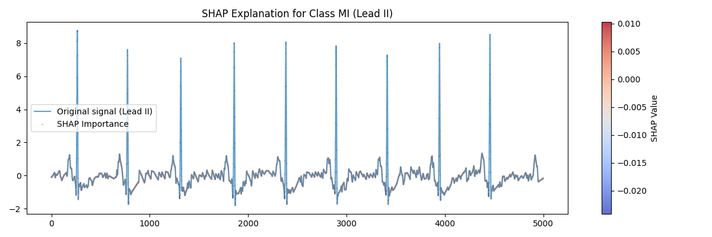
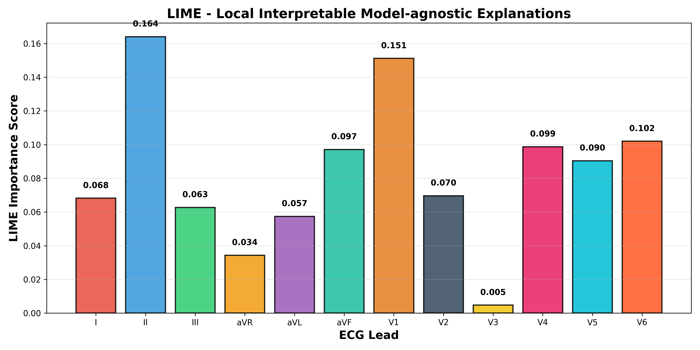
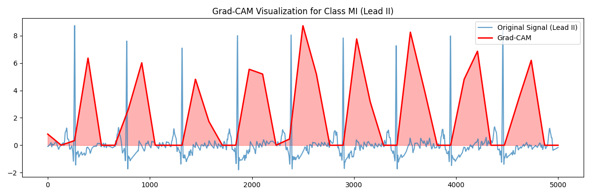
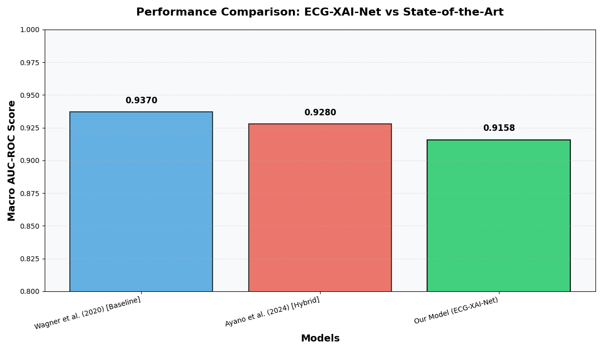

# AI-Driven Clinical Signal Analysis & Interpretability


This repository contains the source code for the M.Tech Project (MTP-2) developed by **Rajesh Kumar (M25AI1093)**. 
It features a comprehensive Deep Learning pipeline designed for analyzing medical physiological signals (utilizing `wfdb`). The project goes beyond basic prediction by incorporating state-of-the-art **Explainable AI (XAI)** techniques and automated **Generative AI clinical report generation**.

---

## 📑 Table of Contents
- [System Architecture](#-system-architecture)
- [Features](#-features)
- [Project Structure](#-project-structure)
- [Installation](#-installation)
- [Usage](#-usage)
- [Results](#-results)
- [Methodology](#-methodology)
- [Author](#-author)

---

## 🏗 System Architecture

The following diagram illustrates the end-to-end pipeline of the project:



---

## 🌟 Features
- **Data Pipeline:** Automated loading and preprocessing of clinical waveform data via the `wfdb` library.
- **Deep Learning Architectures:** Custom PyTorch models optimized for physiological signal classification.
- **Explainable AI (XAI):** In-depth model interpretability using **SHAP**, **Captum**, and **LIME** to ensure clinical trust and transparency.
- **GenAI Clinical Reports:** Automated generation of human-readable clinical reports based on model predictions and XAI outputs.
- **Interactive Dashboard:** Visual analytics dashboard for dynamically exploring model performance and signal data.
- **Benchmarking & Error Analysis:** Comprehensive scripts for evaluating curves, comparing models, and diagnosing errors.

---

## 📂 Project Structure

The project follows a modular and professional standard layout:

```text
MTP-2/
├── models/                     # Saved PyTorch model weights (.pt / .pth)
├── plots/                      # Generated evaluation curves, visualizations, and XAI plots
├── reports/                    # Output directory for generated GenAI clinical reports
├── src/                        # Core source code modules
│   ├── config.py               # Hyperparameters and global configurations
│   ├── dataset.py              # Data loaders and WFDB parsing logic
│   ├── preprocessing.py        # Signal filtering, normalization, and prep
│   ├── augmentation.py         # Data augmentation techniques
│   ├── models.py               # Deep learning network definitions
│   ├── loss.py                 # Custom loss functions
│   ├── train.py                # Main training loop
│   ├── evaluate.py             # Evaluation metrics and validation loop
│   ├── interpretability.py     # Core logic for SHAP/Captum/LIME
│   ├── dashboard.py            # Code for interactive UI dashboard
│   ├── main.py                 # Main entry point to run the pipeline
│   └── generate_*.py           # Dedicated scripts for generating reports, benchmarks, and XAI plots
├── mtp-env/                    # Python virtual environment (ignored in git)
└── requirements.txt            # Project dependencies
```

---

## 🛠 Installation

To set up the development environment locally, follow these steps:

**1. Clone the repository (or navigate to the project folder):**
```bash
cd MTP-2
```

**2. Activate the virtual environment:**
Ensure your `mtp-env` is active.
```bash
# On Windows
mtp-env\Scripts\activate
```

**3. Install Dependencies:**
```bash
pip install -r requirements.txt
```

---

## 🚀 Usage

The project is controlled through the `main.py` script using the `--mode` flag. Make sure your virtual environment is activated and you are inside the `src/` directory before running any commands.

```bash
cd src
```

### 1. Training the Model
To train the deep learning model from scratch, run:
```bash
python main.py --mode train
```
This will:
- Load and preprocess the clinical signal dataset using `wfdb`.
- Apply data augmentation techniques (`augmentation.py`).
- Train the model as defined in `models.py` using the configurations set in `config.py`.
- Save the trained model weights to the `models/` directory.

> **Tip:** You can modify hyperparameters (learning rate, batch size, epochs, etc.) in `src/config.py` before training.

### 2. Evaluating the Model
To evaluate a trained model on the test dataset, run:
```bash
python main.py --mode eval
```
This will:
- Load the saved model weights from the `models/` directory.
- Run inference on the test set.
- Print evaluation metrics such as accuracy, precision, recall, and F1-score.

### 3. Generating Plots and Visualizations
To generate all evaluation and performance plots, run:
```bash
python generate_plots.py
```
This will produce plots including ROC curves, confusion matrices, and performance comparisons, saved in the `plots/` directory.

**Additional visualization scripts:**
| Script | Description |
|---|---|
| `python generate_XAI_visualizations.py` | Generate Grad-CAM, SHAP, and DeepLift explainability plots |
| `python generate_XAI_lime_explanation.py` | Generate LIME-based local explanations |
| `python generate_DL_evaluation_curves.py` | Generate ROC, Precision-Recall, and Calibration curves |
| `python generate_DL_benchmark_comparison.py` | Compare model performance against standard benchmarks |
| `python generate_DL_error_analysis.py` | Analyze and visualize model prediction errors |
| `python generate_performance_comparison.py` | Generate performance comparison tables |
| `python generate_GenAI_clinical_report.py` | Generate AI-powered clinical reports (saved in `reports/`) |
| `python generate_CV_Visualization_report.py` | Generate cross-validation visualization reports |

### 4. Launching the Dashboard
To start the interactive visualization dashboard powered by Streamlit:
```bash
streamlit run dashboard.py
```
This will open a local web server (usually at `http://localhost:8501`) in your browser where you can interactively explore model performance, signal visualizations, and XAI outputs.

---

## 📊 Results

Below are some sample outputs generated by the pipeline:

### Model Performance
| | |
|---|---|
|  |  |
| *Confusion Matrix* | *ROC Curves* |

### Explainable AI (XAI) Visualizations
| | |
|---|---|
|  |  |
| *SHAP Feature Attribution* | *LIME Local Explanation* |
|  |  |
| *Grad-CAM Heatmap* | *Benchmark Comparison* |

---

## 🔬 Methodology Overview
1. **Signal Acquisition:** Raw signals are retrieved using `wfdb`.
2. **Preprocessing:** Noise reduction, segmentation, and normalization (`src/preprocessing.py`).
3. **Training:** Deep learning feature extraction and classification (`src/models.py`, `src/train.py`).
4. **Validation:** Cross-validation and performance benchmarking against standard datasets (`src/generate_DL_benchmark_comparison.py`).
5. **Interpretation:** Highlighting key waveform segments that contributed to the model's decision (`src/interpretability.py`).

---

## 🎓 Author
**Rajesh Kumar**
- Program: M.Tech Project
- Institution: IIT Jodhpur

---
*Note: This repository is intended for academic research and evaluation purposes. Ensure proper data privacy guidelines are followed when utilizing clinical datasets.*
